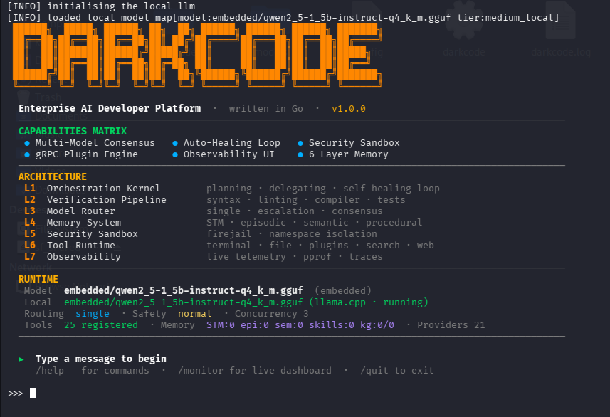
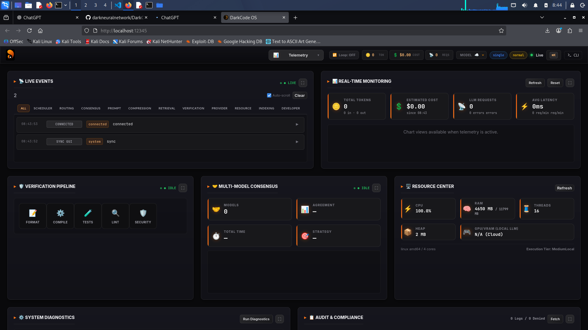
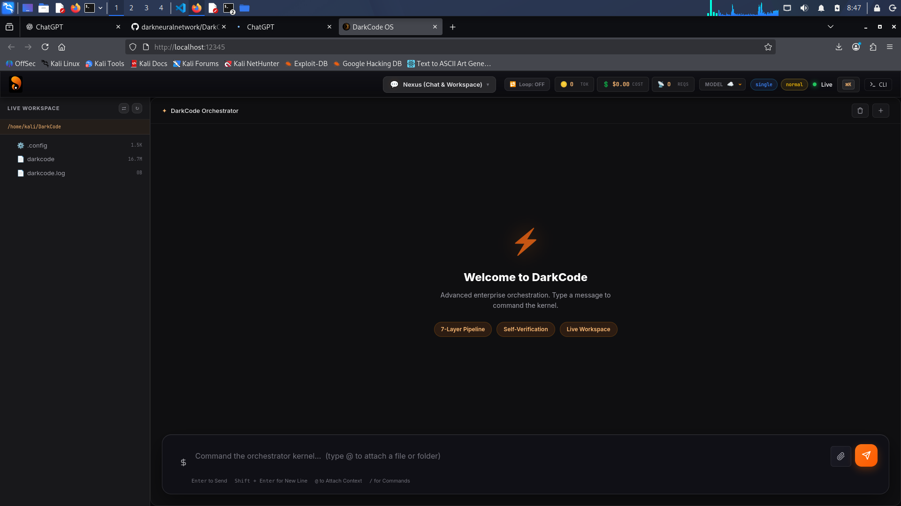

<div align="center">



# DarkCode

**Next-Generation Autonomous AI Agent Platform**

A local-first, modular AI agent operating system built in Go for autonomous software engineering, intelligent automation, and scalable AI workflows.

Engineered by [**Team Dark Neural Network (DNN)**](https://darkneuralnetwork.com)


</div>

---

## ⚡ Overview

The next generation of AI applications requires more than just a conversational model. DarkCode reimagines AI engineering by distributing intelligence across specialized, modular systems. 

**Traditional AI struggles with:**
* Exponential inference costs
* Massive context requirements
* Volatile memory and repeated reasoning
* Poor holistic project understanding
* Unreliable execution and cloud dependency

**The DarkCode Objective:**
> Create an AI system that becomes more efficient over time by remembering, learning, and reusing knowledge instead of repeatedly solving the same problems.

---

## 🔄 Loop Engineering Technology

DarkCode is built on advanced **Loop Engineering** to create self-sustaining, autonomous workflows. Instead of linear, one-off executions, the platform operates on continuous feedback and improvement loops:

* **Execution Loops:** Iterative *plan-execute-verify* cycles ensuring robust task completion.
* **Feedback Loops:** Real-time monitoring of environment and tool outputs to dynamically course-correct failures.
* **Memory Optimization Loops:** Continuous background processes that compress working memory into episodic and semantic Knowledge Graph updates.
* **Reflective Loops:** Self-evaluating mechanisms where agents review their own code and logic before final deployment.

---

## 🧠 The DarkCode Advantage

Most assistants operate on a simple **User → LLM → Response** loop. DarkCode operates as a dynamic, intelligent execution engine.

**The Execution Pipeline:**
`User Goal` ➔ `Intent Analysis` ➔ `Planning Engine` ➔ `Task Decomposition` ➔ `Specialized Agents` ➔ `Tool Execution` ➔ `Verification` ➔ `Memory Update` ➔ `Final Result`

**What this unlocks:**
* Superior task handling and precision
* Drastically reduced token consumption
* Reusable, persistent knowledge
* Controlled, secure automation

---

## 🏗️ Core Architecture

<div align="center">
  
</div>

DarkCode is built on a foundation of independent, highly specialized layers.

```text
                           [ User ]
                              ↓
                        [ Web UI / CLI ]
                              ↓
                    [ Orchestration Kernel ]
      ┌───────────────┬───────────────┬───────────────┐
  [ Planner ]   [ Model Router ]  [ Memory System ]
      │               │               │
  [ Agents ]    [ Local/Cloud ]   [ RAG + Graph ]
      └───────────────┼───────────────┘
                      ↓
               [ Tool Runtime ]
      ┌─────────┬─────┴───┬─────────┬─────────┐
   [ Files ] [ Terminal ] [ Git ] [ Web ] [ APIs ]
```

### Component Breakdown

* **Orchestration Kernel:** Commands the execution lifecycle, agent coordination, and workflow state.
* **Planner:** Translates raw objectives into actionable, step-by-step execution strategies.
* **Model Router:** Dynamically balances workloads between local and cloud models for optimal cost and latency.
* **Agent Runtime:** Hosts specialized sub-agents with strict task isolation and parallel execution.
* **Tool Runtime:** Provides secure, sandboxed access to the filesystem, terminal, Git, and the web.

---

## 🔀 Intelligent Model Routing

DarkCode thrives on a **local-first AI strategy**. Not every task requires a massive, expensive frontier model. Our routing engine ensures you use the smallest capable model for every action.

**Local Models (Fast & Free):**
* Code explanation & formatting
* Summarization & classification
* Simple edits & repetitive tasks
* RAG retrieval

**Cloud Models (Heavy Lifting):**
* Complex system architecture
* Advanced reasoning & synthesis
* Deep debugging sessions

---

## 💾 Advanced Memory & Knowledge Graph

Memory in DarkCode is far more than chat history. It is a persistent intelligence layer that evolves with your projects.

**The Memory Hierarchy:**
`Conversation` ➔ `Working` ➔ `Episodic` ➔ `Semantic` ➔ `Knowledge Graph`

**Continuous Knowledge Improvement:**
DarkCode actively maps files, functions, APIs, and dependencies into its Knowledge Graph. Every meaningful interaction feeds the system.

`More Usage` ➔ `Deeper Knowledge` ➔ `Better Retrieval` ➔ `Fewer API Calls` ➔ `Lower Costs`

---

## 🛡️ Secure Autonomous Execution

Powerful automation requires uncompromising security. DarkCode implements rigid boundaries to ensure safe execution:

* Capability-based access
* Strict tool validation
* Hardened execution controls
* Configurable permission boundaries

---

## 🖥️ Interfaces

### Web UI
<div align="center">
  
</div>

A comprehensive control center featuring AI conversations, agent monitoring, visual execution tracking, memory inspection, and deep Knowledge Graph visibility.

### Command Line Interface
Built for power users and CI/CD pipelines. Start tasks, configure models, and automate workflows directly from your terminal.

```bash
# Launch the Web GUI
$ darkcode --gui

# Run the standard CLI
$ darkcode
```

---

## 🚀 Installation & Releases

DarkCode provides native, ready-to-use binaries for seamless deployment.

| Platform | Package | Interface |
| :--- | :--- | :--- |
| **Windows** | `.exe` | Web UI + CLI |
| **Linux (Debian/Ubuntu)** | `.deb` | Web UI + CLI |

### Quick Start

**Windows:**
```powershell
.\darkcode.exe --gui
```

**Linux:**
```bash
sudo apt install ./darkcode.deb
darkcode --gui
```

---

## 🛠️ Technology Stack

| Layer | Technology |
| :--- | :--- |
| **Language** | Go (Golang) |
| **Agent Runtime** | Custom Modular Orchestration Engine |
| **Models** | Local (llama.cpp compatible) + Cloud LLMs |
| **Memory** | Native Go Memory Architecture |
| **Retrieval** | Hybrid RAG Engine |
| **Intelligence** | Dynamic Knowledge Graph |
| **Execution** | Secure Tool Runtime Sandbox |

---

## 🗺️ Roadmap

**Current Focus:**
* Agent orchestration & local LLM optimization
* RAG improvements & Knowledge Graph reasoning
* Tool reliability & cost minimization
* Self sustainable system with Loop Engineering

**Future Horizons:**
* Advanced procedural memory & self-learning
* Autonomous debugging & distributed agents
* Enterprise-scale deployment collaboration

---

## 🤝 Contributing

DarkCode is evolving rapidly. We are actively looking for contributors passionate about:
* Autonomous AI agents
* LLM optimization & memory systems
* Knowledge Graphs & AI infrastructure

---

## ⚖️ License

DarkCode is proudly open-source, released under the **GNU General Public License v3.0 (GPL-3.0)**. 

You are free to use, study, modify, and distribute this software, provided all derivative works remain under the GPL-3.0 license. [Read the full license here](LICENSE).

---

<div align="center">

### Engineered by [Dark Neural Network](https://darkneuralnetwork.com)
*Building the next generation of intelligent autonomous systems.*

🌐 [Website](https://darkneuralnetwork.com) &nbsp;&nbsp;•&nbsp;&nbsp; ⭐ Star on GitHub &nbsp;&nbsp;•&nbsp;&nbsp; 🤝 Join the Community

*If DarkCode helps you build, automate, or explore the future of AI agents, consider supporting the project by contributing or sharing feedback.*

**DarkCode is not just an assistant. It is a foundation for building intelligent systems.**

</div>
