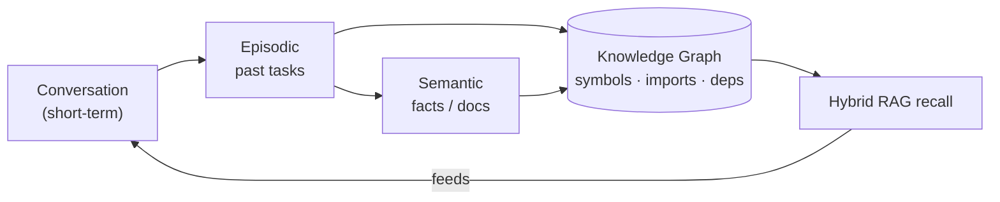

<div align="center">


# DarkCode

**A local-first, autonomous AI agent platform for software engineering — built in Go.**

Engineered by [**Team Dark Neural Network (DNN)**](https://darkneuralnetwork.com)

[](https://github.com/darkneuralnetwork/DarkCode/actions/workflows/ci.yml)
[](https://github.com/darkneuralnetwork/DarkCode/releases)


[**Install**](#-installation) · [**Quick Start**](#-quick-start) · [**How It Works**](#-how-it-works) · [**Configuration**](#%EF%B8%8F-configuration) · [**Wiki**](https://github.com/darkneuralnetwork/DarkCode/wiki)

</div>

---

## ⚡ What is DarkCode?

Most AI coding assistants are a thin loop: **you → cloud model → answer**, paying full price for every token and forgetting everything between sessions.

DarkCode is different. It runs on **your machine**, keeps a durable, growing memory of your code, and — crucially — **tries to answer from local knowledge before ever calling a cloud model.** The result is an agent that gets *cheaper and smarter the more you use it.*

> **The objective:** an AI system that becomes more efficient over time by remembering, learning, and reusing knowledge instead of repeatedly re-solving the same problems.

**Design principles**

| Principle | What it means |
| :-- | :-- |
| 🏠 **Local-first** | Runs offline with an embedded `llama.cpp` engine; cloud is optional. |
| 💸 **Cost-minimizing** | A cognition cascade answers from tools, cache, and memory before any LLM call. |
| 🧠 **Persistent memory** | Episodic + semantic memory and a code knowledge graph, shared across every project. |
| 🔒 **Secure by default** | Permission gate, workspace confinement, and an optional filesystem sandbox. |
| 📦 **Zero heavy deps** | A single Go binary — no database, no runtime, no framework. |

---

## 🧭 How It Works

### Architecture

DarkCode is a set of independent, specialized layers behind one binary.


```mermaid
flowchart TD
    U(["You"]) --> IF["CLI · Web GUI · single-query"]
    IF --> K[["Orchestration Kernel"]]

    K --> CAS{"Cognition Cascade<br/>answer locally?"}
    CAS -->|"hit — 0 LLM calls"| OUT(["Answer"])
    CAS -->|miss| RT["Model Router"]

    RT --> LOCAL["Local llama.cpp"]
    RT --> CLOUD["Cloud providers"]
    K --> AG["Sub-agents · ReAct loop"]
    AG --> TOOLS["Tool Runtime"]

    TOOLS --> T1["files · terminal · git"]
    TOOLS --> T2["web · search · MCP"]
    K <--> MEM[("Memory System<br/>episodic · semantic<br/>+ knowledge graph")]
    TOOLS -.->|"gated by"| SEC["Permission Gate · Sandbox"]

    LOCAL --> OUT
    CLOUD --> OUT
    AG --> OUT
```

### The Cognition Cascade — why it's cheap

Before any paid model runs, a query descends a cost-ascending ladder of **local** answerers. A confident hit answers instantly, for free.


```mermaid
flowchart LR
    Q(["Query"]) --> R0["Deterministic tools<br/>AST · ripgrep"]
    R0 -->|miss| R1["Answer cache<br/>exact / near-dup"]
    R1 -->|miss| R2["Knowledge graph<br/>typed, cited facts"]
    R2 -->|miss| R3["Episodic recall<br/>a past answer"]
    R3 -->|miss| LLM["LLM<br/>local first, then cloud"]

    R0 -->|hit| A(["Answer — $0"])
    R1 -->|hit| A
    R2 -->|hit| A
    R3 -->|hit| A
```

Every rung records whether it answered, so you can see exactly how many calls were avoided (`/cascade` in the GUI, `/api/cascade`). More usage → deeper knowledge → better retrieval → **fewer API calls → lower cost.**

---

## 🧠 Memory & Knowledge Graph

Memory is a persistent intelligence layer, not chat history — and it's **system-wide**, shared across all your projects.


```mermaid
flowchart LR
    C["Conversation<br/>(short-term)"] --> E["Episodic<br/>past tasks"]
    E --> S["Semantic<br/>facts / docs"]
    E --> KG[("Knowledge Graph<br/>symbols · imports · deps")]
    S --> KG
    KG --> R["Hybrid RAG recall"]
    R -->|feeds| C
```

Writes are atomic (crash-safe), and an optional local embedder turns recall genuinely semantic. The graph indexes your codebase's symbols, imports, and dependencies with provenance.

---

## 🔀 Model Routing

Use the smallest capable model for every action. Routing has three modes:

| Mode | Behavior |
| :-- | :-- |
| `single` | One primary model handles everything. |
| `escalation` | Start small/local; escalate to a stronger model only when needed. |
| `consensus` | Multiple models answer; the primary synthesizes the final result. |

Pick the "brain" per request — `local` (offline), `cloud`, or `auto` (local-first). Supported providers: **OpenAI, Anthropic, OpenRouter, Google, Groq, DeepSeek, Mistral, xAI, Together, Ollama, LM Studio,** and the built-in **embedded** local engine.

---

## 🔒 Security

DarkCode executes real shell commands and edits files, so it treats safety as a first-class concern:

- **Permission gate** — dangerous actions (destructive commands, writes, `git push`, interpreter one-liners, pipe-to-shell) require approval, with three levels: `strict` / `normal` / `relaxed`.
- **Workspace confinement** — file writes are kept inside the active project, with symlink escapes blocked.
- **Filesystem sandbox** — optional `bubblewrap`/`firejail` confinement so shell commands can only write inside the workspace. Modes: `off` / `auto` / `on` / `strict`.
- **Secret scanning & SSRF guards** — credentials in tool args force a prompt; outbound fetches can't reach loopback or cloud-metadata endpoints.

> See the [Security chapter of the Wiki](https://github.com/darkneuralnetwork/DarkCode/wiki/Home#-security-model) for the full model.

---

## 🚀 Installation

### Option 1 — Prebuilt release (recommended)

Grab the latest from the [**Releases page**](https://github.com/darkneuralnetwork/DarkCode/releases):

| Platform | Asset |
| :-- | :-- |
| Linux (Debian/Ubuntu, 64-bit) | `darkcode-vX.Y.Z-linux-amd64.deb` |
| Linux (32-bit) | `darkcode-vX.Y.Z-linux-i386.deb` |
| Windows (64-bit) | `darkcode-vX.Y.Z-windows-amd64.exe` |

```bash
# Debian / Ubuntu
sudo apt install ./darkcode-*-linux-amd64.deb
darkcode --gui
```

Verify your download against the published `SHA256SUMS`.

### Option 2 — Build from source

Requires **Go 1.24+** and Git.

```bash
git clone https://github.com/darkneuralnetwork/DarkCode.git
cd DarkCode
make build      # or: go build -o darkcode .
./darkcode --gui
```

### Option 3 — Docker

```bash
docker build -t darkcode .
docker run --rm -it -p 12345:12345 -v ~/.darkcode:/root/.darkcode darkcode --gui
```

---

## 🏁 Quick Start

```bash
# Interactive terminal
darkcode

# Web dashboard on http://localhost:12345
darkcode --gui

# One-shot, non-interactive
darkcode -q "explain what cmd/root.go does"

# Register a cloud model and go
darkcode --add-model gpt-4o --provider openai --api-key sk-...
```

On first launch DarkCode initializes the agent runtime, memory system, knowledge graph, tool runtime, and model router. Configure models via the **Web UI settings** or the config file (below).

---

## ⚙️ Configuration

Config lives at **`~/.darkcode/config.json`** (one install serves every directory). Common keys:

| Key | Values | Purpose |
| :-- | :-- | :-- |
| `routing_mode` | `single` · `escalation` · `consensus` | How models are selected. |
| `safety_level` | `strict` · `normal` · `relaxed` | Approval strictness. |
| `sandbox` | `off` · `auto` · `on` · `strict` | Shell-command confinement. |
| `local_mode` | `off` · `auto` · `on` · `force` | Local-LLM preference (`force` = never touch cloud). |
| `memory_profile` | `lean` · `balanced` · `max` | Local model context window / RAM. |
| `use_local_for_aux` | `true` / `false` | Route background calls to the local model (cost saver). |
| `cost_limit_per_day_usd` | number | Optional spend cap. |

API keys can also come from the environment (`OPENAI_API_KEY`, `ANTHROPIC_API_KEY`, …). The full reference is in the [**Wiki → Configuration**](https://github.com/darkneuralnetwork/DarkCode/wiki/Home#%EF%B8%8F-configuration-reference).

---

## 🖥️ Interfaces

<div align="center">
  
</div>

- **Web UI** — conversations, live agent monitoring, blueprint/plan tracking, memory inspection, and knowledge-graph visibility.
- **CLI** — a full slash-command palette (`/help`). Highlights: `/model`, `/mode`, `/brain`, `/safety`, `/sandbox`, `/local`, `/ingest`, `/know`, `/project`, `/usage`, `/cascade`. Full list in the [**Wiki → CLI Reference**](https://github.com/darkneuralnetwork/DarkCode/wiki/Home#-cli-command-reference).

---

## 🛠️ Build, Test & Release

```bash
make ci          # fmt-check + vet + build + race tests (what CI runs)
make test        # unit tests
./build.sh 1.2.0 # cross-compile release artifacts into dist/
```

CI runs on every push via GitHub Actions (build + vet + gofmt + race tests + a cross-compile matrix). Releases are cut with `build.sh` (linux `.deb`, windows `.exe`, `SHA256SUMS`).

---

## 📚 Documentation

The [**DarkCode Wiki**](https://github.com/darkneuralnetwork/DarkCode/wiki) covers everything in depth — installation, first-run setup, every concept, the full CLI and configuration reference, the security model, local-LLM tuning, the HTTP API, and troubleshooting.

---

## 🗺️ Roadmap

- ✅ Local-first cascade, knowledge graph, resource-governed local models
- ✅ Config-driven sandbox, CI, atomic memory, request idempotency
- 🔭 SQLite-backed knowledge store for large graphs
- 🔭 Deeper procedural memory & self-learning
- 🔭 Distributed / multi-agent collaboration

---

## 🤝 Contributing

Contributions are welcome. Run `make ci` before opening a PR. We're especially interested in autonomous agents, LLM cost/memory optimization, and knowledge-graph reasoning.

## ⚖️ License

Released under the **GNU General Public License v3.0**. Use, study, modify, and distribute freely; derivative works stay GPL-3.0. [Full text](LICENSE).

---

<div align="center">

### Engineered by [Dark Neural Network](https://darkneuralnetwork.com)
*Building the next generation of intelligent autonomous systems.*

🌐 [Website](https://darkneuralnetwork.com) · ⭐ Star on GitHub · 🤝 Join the Community

**DarkCode is not just an assistant. It is a foundation for building intelligent systems.**

</div>
