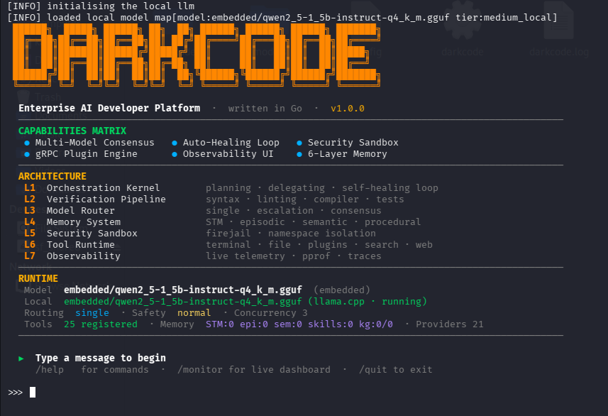
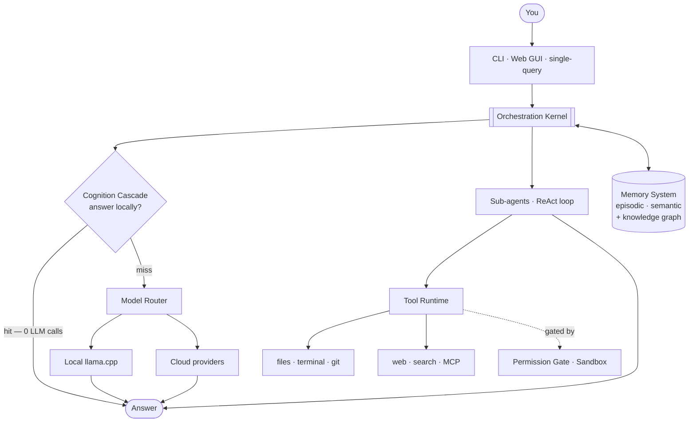
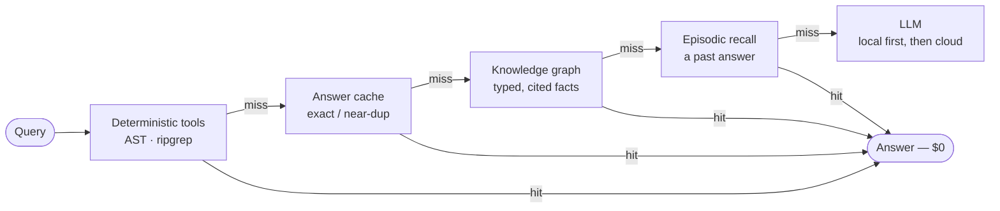
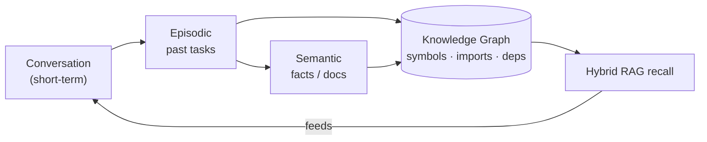
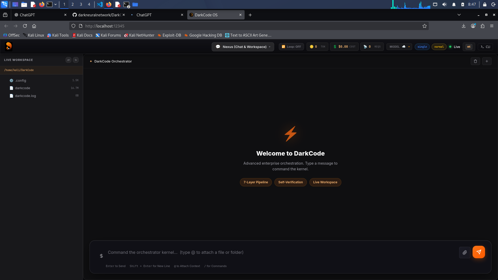

<div align="center">



# DarkCode

**A local-first, autonomous AI agent platform for software engineering — built in Go.**

Engineered by [**Team Dark Neural Network (DNN)**](https://darkneuralnetwork.com)

[](https://github.com/darkneuralnetwork/DarkCode/actions/workflows/ci.yml)
[](https://github.com/darkneuralnetwork/DarkCode/releases)


[**Install**](#-installation) · [**Quick Start**](#-quick-start) · [**How It Works**](#-how-it-works) · [**Configuration**](#%EF%B8%8F-configuration) · [**Wiki**](https://github.com/darkneuralnetwork/DarkCode/wiki)

</div>

---

## ⚡ What is DarkCode?

Most AI coding assistants are a thin loop: **you → cloud model → answer**, paying full price for every token and forgetting everything between sessions.

DarkCode is different. It runs on **your machine**, keeps a durable, growing memory of your code, and — crucially — **tries to answer from local knowledge before ever calling a cloud model.** The result is an agent that gets *cheaper and smarter the more you use it.*

> **The objective:** an AI system that becomes more efficient over time by remembering, learning, and reusing knowledge instead of repeatedly re-solving the same problems.

**Design principles**

| Principle | What it means |
| :-- | :-- |
| 🏠 **Local-first** | Runs offline with an embedded `llama.cpp` engine; cloud is optional. |
| 💸 **Cost-minimizing** | A cognition cascade answers from tools, cache, and memory before any LLM call. |
| 🧠 **Persistent memory** | Episodic + semantic memory and a code knowledge graph, shared across every project. |
| 🔒 **Secure by default** | Permission gate, workspace confinement, and an optional filesystem sandbox. |
| 📦 **Zero heavy deps** | A single Go binary — no database, no runtime, no framework. |

---

## 🧭 How It Works

### Architecture

DarkCode is a set of independent, specialized layers behind one binary.


```mermaid
flowchart TD
    U(["You"]) --> IF["CLI · Web GUI · single-query"]
    IF --> K[["Orchestration Kernel"]]

    K --> CAS{"Cognition Cascade<br/>answer locally?"}
    CAS -->|"hit — 0 LLM calls"| OUT(["Answer"])
    CAS -->|miss| RT["Model Router"]

    RT --> LOCAL["Local llama.cpp"]
    RT --> CLOUD["Cloud providers"]
    K --> AG["Sub-agents · ReAct loop"]
    AG --> TOOLS["Tool Runtime"]

    TOOLS --> T1["files · terminal · git"]
    TOOLS --> T2["web · search · MCP"]
    K <--> MEM[("Memory System<br/>episodic · semantic<br/>+ knowledge graph")]
    TOOLS -.->|"gated by"| SEC["Permission Gate · Sandbox"]

    LOCAL --> OUT
    CLOUD --> OUT
    AG --> OUT
```

### The Cognition Cascade — why it's cheap

Before any paid model runs, a query descends a cost-ascending ladder of **local** answerers. A confident hit answers instantly, for free.


```mermaid
flowchart LR
    Q(["Query"]) --> R0["Deterministic tools<br/>AST · ripgrep"]
    R0 -->|miss| R1["Answer cache<br/>exact / near-dup"]
    R1 -->|miss| R2["Knowledge graph<br/>typed, cited facts"]
    R2 -->|miss| R3["Episodic recall<br/>a past answer"]
    R3 -->|miss| LLM["LLM<br/>local first, then cloud"]

    R0 -->|hit| A(["Answer — $0"])
    R1 -->|hit| A
    R2 -->|hit| A
    R3 -->|hit| A
```

Every rung records whether it answered, so you can see exactly how many calls were avoided (`/cascade` in the GUI, `/api/cascade`). More usage → deeper knowledge → better retrieval → **fewer API calls → lower cost.**

---

## 🧠 Memory & Knowledge Graph

Memory is a persistent intelligence layer, not chat history — and it's **system-wide**, shared across all your projects.

The graph indexes **Go, TypeScript/JavaScript, Python, Rust and Java** into one
uniform shape (defines · imports · references · extends), so a query never has
to branch on language. Go is parsed exactly by `go/ast`; the rest use a
dependency-free pattern scanner, and the difference is recorded as node
confidence rather than hidden.

Because the graph knows what references what, it answers questions no language
server can — from the CLI (`/health`) or as an agent tool (`graph_query`):

| Query | Answers |
| :-- | :-- |
| `blast_radius` | "What breaks if I change this file?" — shown in the plan approval gate before you approve |
| `health` | Repository health score with ranked structural issues |
| `cycles` · `dead_code` · `untested` | Import cycles, unreferenced symbols, high-fan-in code with no tests |
| `evolution` | What changed *structurally* between two commits — new dependencies, API breaks, cycles created — not a line diff |
| `defect_risk` · `root_cause` | Which files bugs cluster in, and — when a test fails — the likely culprits ranked by fix history × graph distance |
| `structure` | The shape of the code relevant to a goal at **~1/30th the tokens** of reading the files |
| `simulate` | "What if we split this package?" — measures a proposed change against the real graph before you write it |
| `patterns` · `violations` | Conventions this repository actually keeps, and the files that break them |
| `policy` | Architecture you declared — forbidden dependencies, coupling ceilings, coverage floors — checked rather than hoped for |
| `trends` · `alerts` | Where the structure is heading, and what changed since last time |
| `low_confidence` · `stale` | Beliefs worth re-checking; files indexed before the current `HEAD` |

Every risk score carries the reasons that produced it, so a weak signal reads as
weak rather than as confident nonsense.

**Structure is watched, not only asked about.** An optional background daemon
re-scans on a schedule and raises an alert when something *changes* — a cycle
that appeared this week, coupling climbing for a month, a hotspot that just lost
its last test. It holds to a share of one core (5% by default) by measuring each
scan and resting proportionally, so a repository ten times larger scans ten times
less often instead of costing ten times the CPU. Alerts fire on transitions, so a
cycle that has been there for a year stays quiet.

That series is also a time base: `trends` fits each metric against time and
reports R² next to the slope, calling anything below a weak fit *"no discernible
trend"* rather than giving it a confident date. A projection nobody can audit is
worse than none, because it gets believed.

**And where runtime truth is needed, it is read, not guessed.** The `debug` tool
stops a running program at a line and reports every local in scope plus any
expression you ask for — one call, no print statements, source untouched. Go
goes through delve; Python and JavaScript through the Debug Adapter Protocol,
behind the same tool.

**Where a type checker is needed, one is used.** The graph is repository-wide
and durable but doesn't type-check; a language server does. The `lsp` tool asks
gopls, typescript-language-server, pyright, rust-analyzer or jdtls for a symbol's
real resolution, signature, references, and *actual compiler errors*. Servers
start on demand, and a missing one falls back to the graph rather than failing.


```mermaid
flowchart LR
    C["Conversation<br/>(short-term)"] --> E["Episodic<br/>past tasks"]
    E --> S["Semantic<br/>facts / docs"]
    E --> KG[("Knowledge Graph<br/>symbols · imports · deps")]
    S --> KG
    KG --> R["Hybrid RAG recall"]
    R -->|feeds| C
```

Writes are atomic (crash-safe), and an optional local embedder turns recall genuinely semantic. The graph indexes your codebase's symbols, imports, and dependencies with provenance.

---

## 🔀 Model Routing

Use the smallest capable model for every action. Routing has three modes:

| Mode | Behavior |
| :-- | :-- |
| `single` | One primary model handles everything. |
| `escalation` | Start small/local; escalate to a stronger model only when needed. |
| `consensus` | Multiple models answer; the primary synthesizes, then the **code graph adjudicates** — a candidate whose claims survive verification beats one that merely sounds confident. |

Pick the "brain" per request — `local` (offline), `cloud`, or `auto` (local-first). Supported providers: **OpenAI, Anthropic, OpenRouter, Google, Groq, DeepSeek, Mistral, xAI, Together, Ollama, LM Studio,** and the built-in **embedded** local engine.

---

## ⏪ Undo — checkpoints & rollback

Before **every** file-modifying action, DarkCode snapshots the workspace into a
content-addressed store shared across projects, so a hundred checkpoints cost
roughly the size of what actually changed.

```bash
/rollback            # list checkpoints
/rollback diff 7     # what changed since checkpoint 7
/rollback 7          # restore the workspace to checkpoint 7
/rollback 7 main.go  # restore a single file
```

Rolling back also **rewinds the conversation** to match the filesystem —
otherwise the agent keeps reasoning from turns describing files that no longer
exist. The rollback is itself snapshotted first, so the undo can be undone.

Every run is also recorded as an ordered event log, so a finished task can be
**scrubbed through** afterwards — which step ran, what it produced, where it
went wrong — rather than reconstructed from a wall of output.

---

## ✅ Changes that have been run, not just written

Asking a model for a fix gets you one attempt. Asking three times gets you three,
and the interesting question is which to keep — so `rank_patches` applies each
candidate on its own, runs the project's verifier, and restores the tree.

The ranking is deliberately **lexicographic, not a weighted blend**: does it
apply, does the verifier pass, and only then how much of the repository it
disturbs. A patch that passes beats every patch that does not, however tidy they
look — averaging those into one number is exactly how a neat broken patch wins.
When nothing passes it says *keep none* rather than crowning the least bad.

`self_heal` builds on that. It turns structural findings — an untested hotspot, a
file breaking a convention the rest of its package keeps — into a branch, but
**only after the verifier exits zero with the change applied**. A finding whose
candidates all fail produces nothing rather than a hopeful suggestion, and the
gate is re-applied at staging rather than trusted from the caller.

Nothing is ever pushed and no pull request is opened. The fix lands on its own
branch, the checkout returns to where it started, and a dirty tree is refused
outright — staging on top of uncommitted work would mix the two.

---

## 🔎 Research

`research` answers a question from several sources in one call: it finds
candidate pages, reads them concurrently, reduces each to readable text, and
returns one sourced digest. Using `web_search` and `web_fetch` by hand costs a
model turn per step — search, read the list, pick a link, fetch, discover it was
the wrong link — and leaves the raw HTML sitting in the context window afterwards.

Every passage keeps its source as `[S1]`, `[S2]`, so a claim can be cited rather
than laundered. Every URL goes through the SSRF guard, including ones discovered
mid-run, and every fetched page is scanned for prompt injection — a page that
carries indicators is flagged in the digest instead of being quietly blended in.

---

## 📋 Policy

One file — `.darkcode/policy.json` — says what an install may do: which tools
run, how much passes without a human looking, and **which models code may be
sent to**. That last one is the point; the rest can be reasoned about locally,
while the choice of model decides whether source leaves the machine.

```json
{
  "tools":       { "allow_only": ["read_file", "graph_*", "lsp"] },
  "permissions": { "min_safety_level": "strict", "max_blast_radius": 0.1 },
  "models":      { "require_local": true }
}
```

**A policy can only restrict.** It can forbid a tool the config allows, shorten a
timeout, or take a model away — never the reverse. Without that rule, dropping a
policy next to the binary would be a way to *gain* permissions rather than lose
them.

A forbidden model is never registered with the router, so no path can reach it —
not the tier lookup, not consensus fan-out, not a role selector. `require_local`
is checked against the provider's own local flag, so a hosted endpoint can't slip
through by naming itself after a local one, and it refuses providers it can't
identify: *unknown* is not an acceptable answer to "does this leave the machine".

Full reference: [docs/POLICY.md](docs/POLICY.md).

---

## 🔒 Security

DarkCode executes real shell commands and edits files, so it treats safety as a first-class concern:

- **Permission gate** — dangerous actions (destructive commands, writes, `git push`, interpreter one-liners, pipe-to-shell) require approval, with three levels: `strict` / `normal` / `relaxed`.
- **Deny rules** — `deny_rules` refuse matching calls *before* every permissive path, so a configured refusal can't be overridden by the relaxed level or an earlier "allow for session".
- **Fail-closed approvals** — an unanswered prompt denies rather than hanging an unattended run.
- **Prompt-injection scanning** — every file read, fetched page, and GitHub body is scanned for instructions aimed at the model (override phrasing, exfiltration, zero-width/bidi characters, homograph URLs) and wrapped in a *this is data, not instructions* banner.
- **Blast-radius escalation** — editing a file the code graph says much of the repo depends on requires approval even under permissive settings.
- **Workspace confinement** — file writes are kept inside the active project, with symlink escapes blocked.
- **Filesystem sandbox** — optional `bubblewrap`/`firejail` confinement so shell commands can only write inside the workspace. Modes: `off` / `auto` / `on` / `strict`.
- **Execution backends** — run shell commands `local` (sandboxed), in a disposable `docker` container (all capabilities dropped, no network by default), or on a remote host over `ssh`.
- **Air-gap mode** — `air_gap: true` refuses every connection leaving the machine, enforced at dial time; local model servers keep working.
- **Secret scanning, vault-backed keys & SSRF guards** — credentials in tool args force a prompt; API keys can live in 1Password/Bitwarden/`pass` via `op://`, `bw://`, `pass://` references instead of plaintext config; outbound fetches can't reach loopback or cloud-metadata endpoints.
- **Policy as code** — a separate `policy.json` that can tighten tools, approvals and model choice, and can never loosen them. See [Policy](#-policy).
- **Editor sessions are gated too** — under ACP, approvals go to the editor's own dialog via `session/request_permission`. Anything that isn't an explicit approval — a timeout, a cancellation, an editor that doesn't implement it — denies, so running inside an editor is never the loosest way to run the agent.

> The full model, including what it explicitly does **not** defend against, is in [**docs/THREAT_MODEL.md**](docs/THREAT_MODEL.md).

---

## 🚀 Installation

### Option 1 — Prebuilt release (recommended)

Grab the latest from the [**Releases page**](https://github.com/darkneuralnetwork/DarkCode/releases):

| Platform | Asset |
| :-- | :-- |
| Linux (Debian/Ubuntu, 64-bit) | `darkcode-vX.Y.Z-linux-amd64.deb` |
| Linux (32-bit) | `darkcode-vX.Y.Z-linux-i386.deb` |
| Windows (64-bit) | `darkcode-vX.Y.Z-windows-amd64.exe` |

```bash
# Debian / Ubuntu
sudo apt install ./darkcode-*-linux-amd64.deb
darkcode --gui
```

Verify your download against the published `SHA256SUMS`.

### Option 2 — Build from source

Requires **Go 1.24+** and Git.

```bash
git clone https://github.com/darkneuralnetwork/DarkCode.git
cd DarkCode
make build      # or: go build -o darkcode .
./darkcode --gui
```

### Option 3 — Docker

```bash
docker build -t darkcode .
docker run --rm -it -p 12345:12345 -v ~/.darkcode:/root/.darkcode darkcode --gui
```

---

## 🏁 Quick Start

```bash
# Interactive terminal
darkcode

# Web dashboard on http://localhost:12345
darkcode --gui

# One-shot, non-interactive
darkcode -q "explain what cmd/root.go does"

# Register a cloud model and go
darkcode --add-model gpt-4o --provider openai --api-key sk-...
```

On first launch DarkCode initializes the agent runtime, memory system, knowledge graph, tool runtime, and model router. Configure models via the **Web UI settings** or the config file (below).

---

## ⚙️ Configuration

Config lives at **`~/.darkcode/config.json`** (one install serves every directory). Common keys:

| Key | Values | Purpose |
| :-- | :-- | :-- |
| `routing_mode` | `single` · `escalation` · `consensus` | How models are selected. |
| `safety_level` | `strict` · `normal` · `relaxed` | Approval strictness. |
| `sandbox` | `off` · `auto` · `on` · `strict` | Shell-command confinement. |
| `local_mode` | `off` · `auto` · `on` · `force` | Local-LLM preference (`force` = never touch cloud). |
| `memory_profile` | `lean` · `balanced` · `max` | Local model context window / RAM. |
| `use_local_for_aux` | `true` / `false` | Route background calls to the local model (cost saver). |
| `cost_limit_per_day_usd` | number | Optional spend cap. |
| `execution_backend` | `local` · `docker` · `ssh` | Where shell commands run. |
| `deny_rules` | list | Refuse matching calls outright, e.g. `["terminal:*rm -rf /*", "git:push"]`. |
| `air_gap` | `true` / `false` | Block all outbound network (local models still work). |
| `blast_radius_threshold` | 0–1 | Require approval for edits reaching this share of the repo. |
| `smart_approval` | `true` / `false` | Let the aux model auto-approve routine low-risk calls. |
| `approval_timeout_seconds` | number | Deny (never hang) when a prompt goes unanswered. |

API keys can also come from the environment (`OPENAI_API_KEY`, `ANTHROPIC_API_KEY`, …), or from a password
manager — set `api_key` to `op://Private/OpenAI/credential`, `bw://openai-key`, or `pass://ai/openai` and the
value is fetched at startup instead of being stored on disk. `api_keys` accepts several credentials per model
and rotates across them, parking any that gets rate-limited.

The full reference is in the [**Wiki → Configuration**](https://github.com/darkneuralnetwork/DarkCode/wiki/Home#%EF%B8%8F-configuration-reference).

---

## 🖥️ Interfaces

<div align="center">
  
</div>

- **Web UI** — conversations, live agent monitoring, blueprint/plan tracking, memory inspection, and knowledge-graph visibility.
- **CLI** — a full slash-command palette (`/help`). Highlights: `/rollback`, `/health`, `/evolution`, `/session`, `/model`, `/mode`, `/brain`, `/safety`, `/sandbox`, `/local`, `/ingest`, `/know`, `/project`, `/usage`. Full list in the [**Wiki → CLI Reference**](https://github.com/darkneuralnetwork/DarkCode/wiki/Home#-cli-command-reference).
- **OpenAI-compatible API** — point any OpenAI client at `http://localhost:12345/v1` and use DarkCode as the model (Open WebUI, LibreChat, the `openai` SDK with a custom `base_url`).
- **Editors** — `darkcode --acp` serves the [Agent Client Protocol](https://agentclientprotocol.com), so Zed and the VS Code / JetBrains bridges drive it with no editor-specific code. Verified against Zed's official client SDK.
- **MCP** — DarkCode is both an MCP client (connect external tool servers) and an MCP server (expose its own tools, including the knowledge graph, to other agents).

---

## 🛠️ Build, Test & Release

```bash
make ci          # fmt-check + vet + build + race tests (what CI runs)
make test        # unit tests
make bench       # run the benchmark suite against the built binary
make sbom        # bill of materials, read back out of the built binary
./build.sh 1.3.0 # cross-compile release artifacts into dist/
```

CI runs on every push via GitHub Actions (build + vet + gofmt + race tests + benchmark-fixture validation + a cross-compile matrix).

**Release integrity.** Builds are reproducible — `CGO_ENABLED=0`, `-trimpath`,
`-buildvcs=false` — and the nightly job rebuilds the same tree twice and compares
the bytes, so the claim is tested rather than asserted. Each release carries
`SHA256SUMS`, an SBOM read back out of the linked binary, an optional detached
GPG signature, and a provenance attestation recording *where* an artefact was
built and from which commit, not only what it hashes to.

**Benchmarks.** `bench/` is a reproducible harness: each task is a directory with a prompt, an optional `setup.sh`, and a `verify.sh` whose exit status alone decides pass or fail — no LLM grades the outcome. Add tasks under `bench/tasks/`. CI can't score the suite (it needs a live model) but it does verify every fixture is still solvable, so a broken task is caught before a run scores zero for the wrong reason.

**Releases** are cut with `build.sh`: linux `.deb`, windows `.exe`, an `SBOM.txt`, `SHA256SUMS`, and an optional detached GPG signature (`DARKCODE_SIGNING_KEY=<keyid> ./build.sh`). Builds are reproducible — `CGO_ENABLED=0 -trimpath -buildvcs=false` — so the same tag and toolchain produce identical bytes.

---

## 📚 Documentation

The docs are published at **https://darkneuralnetwork.github.io/darkcode/** —
the same markdown files as below, rendered. There is no separate documentation
source, so a page cannot go stale relative to the repository.


The [**DarkCode Wiki**](https://github.com/darkneuralnetwork/DarkCode/wiki) covers everything in depth — installation, first-run setup, every concept, the full CLI and configuration reference, the security model, local-LLM tuning, the HTTP API, and troubleshooting.

---

## 🗺️ Roadmap

- ✅ Local-first cascade, knowledge graph, resource-governed local models
- ✅ Config-driven sandbox, CI, atomic memory, request idempotency
- ✅ Checkpoints & rollback, prompt-injection defence, deny rules, air-gap mode
- ✅ Multi-language code graph, blast radius, repository health
- ✅ Prompt caching, credential rotation, benchmark harness, threat model
- ✅ Semantic git history, predictive debugging, provenance citation
- ✅ Language-server integration: real types, references and diagnostics
- ✅ Debugger integration (Go, Python, JavaScript) — real runtime values at a breakpoint
- ✅ Editor integration over ACP (Zed, VS Code, JetBrains), with approvals in the editor
- ✅ Structural context compression — repo shape at ~1/30th the tokens
- ✅ Continuous health daemon under a hard CPU budget, with trends and alerts
- ✅ Proof-gated editing — candidate patches ranked by the verifier, not by looks
- ✅ Policy as code for tools, approvals and model choice
- ✅ Build provenance attestation for release artefacts
- 🔭 A published benchmark number
- 🔭 SQLite-backed knowledge store for large graphs

---

## 🤝 Contributing

Contributions are welcome — see [**CONTRIBUTING.md**](CONTRIBUTING.md). Run `make ci` before opening a PR. We're especially interested in autonomous agents, LLM cost/memory optimization, and knowledge-graph reasoning.

## ⚖️ License

Released under the **GNU General Public License v3.0**. Use, study, modify, and distribute freely; derivative works stay GPL-3.0. [Full text](LICENSE).

---

<div align="center">

### Engineered by [Dark Neural Network](https://darkneuralnetwork.com)
*Building the next generation of intelligent autonomous systems.*

🌐 [Website](https://darkneuralnetwork.com) · ⭐ Star on GitHub · 🤝 Join the Community

**DarkCode is not just an assistant. It is a foundation for building intelligent systems.**

</div>
