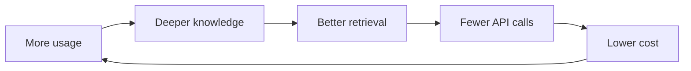
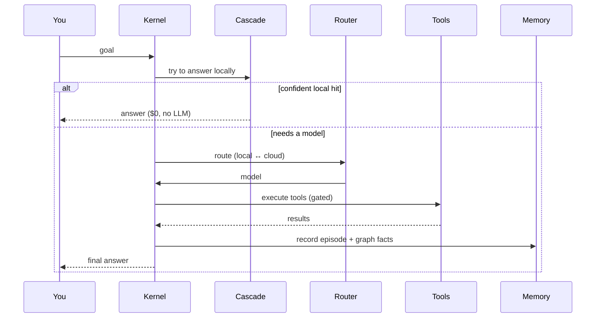
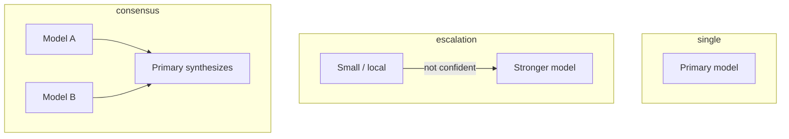
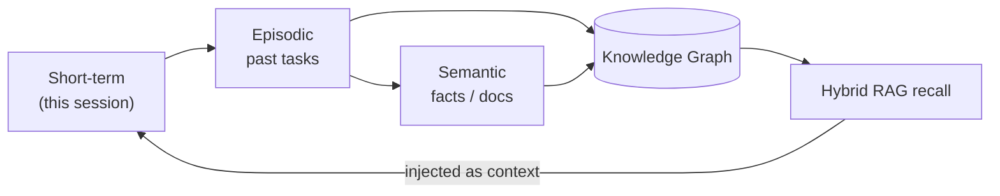
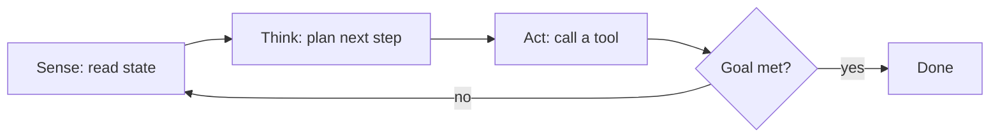
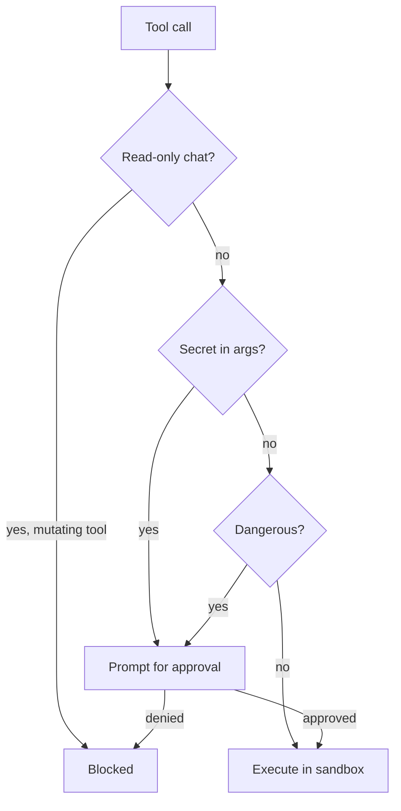

<div align="center">

# 📖 The DarkCode Wiki

**Everything you need to install, run, understand, and extend DarkCode.**

*A local-first, autonomous AI agent platform for software engineering.*

</div>

---

## 🗂️ Table of Contents

1. [Introduction & Philosophy](#-introduction--philosophy)
2. [Installation](#-installation)
3. [First Run & Setup](#-first-run--setup)
4. [Core Concepts](#-core-concepts)
   - [The Orchestration Kernel](#the-orchestration-kernel)
   - [The Cognition Cascade](#the-cognition-cascade)
   - [Model Router & Routing Modes](#model-router--routing-modes)
   - [Memory & the Knowledge Graph](#memory--the-knowledge-graph)
   - [Agents & the ReAct Loop](#agents--the-react-loop)
   - [The Tool Runtime](#the-tool-runtime)
5. [Usage Guide](#-usage-guide)
   - [Chat, Build & Loop modes](#chat-build--loop-modes)
   - [Working with Projects](#working-with-projects)
   - [Teaching DarkCode (Ingestion)](#teaching-darkcode-ingestion)
   - [Running fully offline (Local LLM)](#running-fully-offline-local-llm)
6. [🧩 CLI Command Reference](#-cli-command-reference)
7. [⚙️ Configuration Reference](#%EF%B8%8F-configuration-reference)
8. [🔒 Security Model](#-security-model)
9. [Cost Minimization](#-cost-minimization)
10. [HTTP API Reference](#-http-api-reference)
11. [Building & Releasing](#-building--releasing)
12. [Troubleshooting & FAQ](#-troubleshooting--faq)
13. [Project Layout & Contributing](#-project-layout--contributing)

---

## 🌟 Introduction & Philosophy

Most AI coding tools are a thin wrapper: your prompt goes straight to a cloud model, you pay for every token, and the tool forgets everything the moment the session ends.

DarkCode inverts that. It is a **single Go binary** that runs on your machine and is built around three convictions:

- **Local-first.** An embedded `llama.cpp` engine can run the whole thing offline. The cloud is an option, not a requirement.
- **Answer locally before paying.** A *cognition cascade* tries deterministic tools, a cache, a knowledge graph, and memory — in that order — before any model is invoked.
- **Get smarter over time.** Every interaction feeds a durable, system-wide memory and knowledge graph, so recurring questions get cheaper and more accurate.

The pay-off compounds:



---

## 📦 Installation

### Prebuilt release (recommended)

Download from the [Releases page](https://github.com/darkneuralnetwork/DarkCode/releases).

| Platform | Asset | Install |
| :-- | :-- | :-- |
| Debian/Ubuntu (64-bit) | `darkcode-vX.Y.Z-linux-amd64.deb` | `sudo apt install ./darkcode-*-linux-amd64.deb` |
| Debian/Ubuntu (32-bit) | `darkcode-vX.Y.Z-linux-i386.deb` | `sudo apt install ./darkcode-*-linux-i386.deb` |
| Windows (64-bit) | `darkcode-vX.Y.Z-windows-amd64.exe` | run directly |

Always verify against the release's `SHA256SUMS`:

```bash
sha256sum -c SHA256SUMS
```

### From source

Requires **Go 1.24+** and Git.

```bash
git clone https://github.com/darkneuralnetwork/DarkCode.git
cd DarkCode
make build         # or: go build -o darkcode .
./darkcode --gui
```

### Docker

The image ships with the tools the agent shells out to (bash, git, ripgrep, curl). Mount a volume so memory and config persist:

```bash
docker build -t darkcode .
docker run --rm -it -p 12345:12345 -v ~/.darkcode:/root/.darkcode darkcode --gui
```

### Optional: local sandbox backend

For the filesystem sandbox (see [Security](#-security-model)), install one of:

```bash
sudo apt install bubblewrap   # preferred
# or
sudo apt install firejail
```

---

## 🚦 First Run & Setup

On first launch DarkCode initializes its runtime:

```
✓ Agent Runtime      ✓ Memory System     ✓ Knowledge Graph
✓ Tool Runtime       ✓ Model Router
```

State lives under **`~/.darkcode/`** — one install serves every directory you work in:

```
~/.darkcode/
├── config.json      # your settings and models
├── memory/          # episodic, semantic, procedural + knowledge graph
├── projects/        # per-project context and blueprints
├── bin/             # auto-downloaded llama-server
└── models/          # downloaded GGUF model files
```

**Add a model** — via the Web UI settings, the CLI, or a flag:

```bash
darkcode --add-model gpt-4o --provider openai --api-key sk-...
# or set OPENAI_API_KEY / ANTHROPIC_API_KEY / ... in your environment
```

Or skip cloud entirely and let DarkCode download a resource-appropriate local model on first `/local on`.

---

## 🧠 Core Concepts

### The Orchestration Kernel

The kernel is the brain. For each request it interprets intent, decides whether the task is trivial or needs decomposition, routes to the right model tier, enforces safety, and records the outcome to memory.



### The Cognition Cascade

The single biggest cost lever. Before any paid model runs, the query descends a ladder of local answerers; each answers only when its confidence clears a self-calibrating threshold.

| Rung | Source | Example it answers |
| :-- | :-- | :-- |
| 0 | Deterministic tools (AST + ripgrep) | "where is `Router.Route` defined?" |
| 1 | Answer cache | an exact / near-duplicate repeat question |
| 2 | Knowledge graph | "what imports `orchestrator`?" |
| 3 | Episodic recall | a previously answered question |
| 4/5 | LLM (local first, then cloud) | everything else |

If you immediately re-ask a question a rung just answered, DarkCode treats that as a signal the local answer was unsatisfying, raises that rung's bar, and escalates to a model. Inspect it live with `/cascade` or `GET /api/cascade`.

### Model Router & Routing Modes

The router picks the cheapest capable model. Three modes:



- **`single`** — one primary handles everything.
- **`escalation`** — start cheap; escalate only when needed.
- **`consensus`** — several models answer; the primary merges them.

Per request you can also pick a **brain**: `local` (offline), `cloud`, or `auto` (local-first).

### Memory & the Knowledge Graph

Memory is **system-wide** (shared across every project) and crash-safe (atomic writes).



- **Episodic** — records of past tasks and their outcomes.
- **Semantic** — extracted facts, docs, and code knowledge.
- **Procedural** — reusable "skills" the agent has learned.
- **Knowledge graph** — typed symbol/import/dependency facts with provenance, synced from your codebase.

An optional local embedder makes recall genuinely semantic; without it, recall falls back to keyword overlap.

### Agents & the ReAct Loop

For complex work, DarkCode can run a **Sense → Think → Act** loop (opt-in "Loop" mode) or decompose the task into a DAG of sub-agents that execute with dependency ordering and bounded parallelism.



### The Tool Runtime

Every capability is a tool: `read_file`, `write_file`, `patch`, `list_dir`, `search`, `terminal`, `git`, `web_fetch`, `web_search`, `todo`, `pdf`, plus memory/project tools and any **MCP** servers or in-house tools you connect. Multiple tool calls in one turn run concurrently; a per-tool circuit breaker quarantines a repeatedly failing tool.

---

## 📘 Usage Guide

### Chat, Build & Loop modes

DarkCode adapts how much autonomy it takes based on mode:

| Mode | Tools | Use it for |
| :-- | :-- | :-- |
| **Chat** (general) | read-only | questions, explanations — never writes files |
| **Build** (project) | full | implementing changes, running commands |
| **Build + Loop** | full + ReAct | large multi-step tasks (build an app, big refactor) |

In `auto`, DarkCode classifies each message and picks the mode for you (a plain question stays a single cheap call).

### Working with Projects

A **project** gives DarkCode long-lived context, a persistent plan, and a task workflow. Create one from the GUI's Projects tab or `/project`. DarkCode maintains a live **Blueprint** — an implementation plan plus a Mermaid architecture graph whose nodes turn green as tasks complete.

### Teaching DarkCode (Ingestion)

Feed it knowledge that lands in memory + the graph:

```bash
# in the CLI
/ingest ./docs/architecture.md
/ingest https://example.com/api-reference
```

### Running fully offline (Local LLM)

```bash
/local on        # download + load a resource-appropriate local model
/local force     # pin everything local — routing never touches the cloud
/brain local     # per-request: use the local brain
```

A **resource governor** refuses to load a model that wouldn't fit free memory (weights + KV cache + overhead), so it never swap-thrashes your machine. Tune the window with `/memory-profile lean|balanced|max`.

---

## 🧩 CLI Command Reference

Type `/help` for a searchable palette. Full list:

| Command | Group | Description |
| :-- | :-- | :-- |
| `/help` | Session | Searchable command palette |
| `/new` | Session | Fresh chat — clears context, keeps durable memory |
| `/status` | Session | Kernel/router status |
| `/config` | Session | Show current configuration |
| `/quit` | Session | Exit |
| `/chatmode` | Chat & Modes | Chat / Build / Build+Loop |
| `/brain` | Chat & Modes | Routing brain: auto / local / cloud |
| `/mode` | Chat & Modes | Routing mode: single / escalation / consensus |
| `/safety` | Chat & Modes | Approval level: strict / normal / relaxed |
| `/sandbox` | Chat & Modes | Shell sandbox: off / auto / on / strict |
| `/profile` | Chat & Modes | Execution profile: auto / sequential / parallel |
| `/model` | Models & Local | Switch the active model |
| `/models` | Models & Local | List registered models |
| `/providers` | Models & Local | List configured providers |
| `/local` | Models & Local | Local LLM: off / on / force |
| `/memory-profile` | Models & Local | Local context/RAM: lean / balanced / max |
| `/compressor` | Models & Local | Set the context-compression model |
| `/ingest` | Knowledge & Memory | Teach a file, directory, URL, or text |
| `/memory` | Knowledge & Memory | Memory summary |
| `/skills` | Knowledge & Memory | Learned procedural skills |
| `/episodes` | Knowledge & Memory | Episodic memory (past tasks) |
| `/know` | Knowledge & Memory | Browse the knowledge graph |
| `/learning` | Knowledge & Memory | Learning-engine feedback |
| `/audit` | Knowledge & Memory | Action audit trail |
| `/project` | Project | List / manage projects |
| `/plan` | Project | Active project's implementation plan |
| `/workflow` | Project | Active project's task workflow |
| `/tools` | Tools & System | List / inspect tools |
| `/plugins` | Tools & System | List loaded plugins |
| `/pipeline` | Tools & System | Verification pipeline |
| `/permissions` | Tools & System | Permission-gate settings |
| `/monitor` | Observability | Live monitoring dashboard |
| `/usage` | Observability | Token / cost usage report |
| `/history` | Observability | Full request history |
| `/stats` | Observability | Hardware stats |
| `/events` | Observability | Event stream |
| `/log` | Observability | Replay the activity/trace log |

### Command-line flags

| Flag | Purpose |
| :-- | :-- |
| `-q, --query <text>` | Single non-interactive query |
| `--gui` | Web UI + API on `http://localhost:12345` |
| `--port <n>` | Override the HTTP port |
| `-m, --model <id>` | Override the active model |
| `--mode`, `--safety` | Set routing mode / safety level |
| `--add-model … --provider … --api-key …` | Register a model and exit |
| `--remove-model <id>` | Remove a model and exit |
| `--status`, `--tools` | Print status / tools and exit |
| `--debug` | Enable `/debug/pprof/*` on the GUI (off by default) |

---

## ⚙️ Configuration Reference

Config file: **`~/.darkcode/config.json`**. Edit it directly, use the Web UI, or the CLI. Key fields:

| Key | Values / type | Purpose |
| :-- | :-- | :-- |
| `model`, `provider`, `base_url`, `api_key` | strings | Primary cloud model. |
| `models` | map | Additional registered models (per-tier roles). |
| `routing_mode` | `single` · `escalation` · `consensus` | Model selection strategy. |
| `safety_level` | `strict` · `normal` · `relaxed` | Approval strictness. |
| `sandbox` | `off` · `auto` · `on` · `strict` | Shell-command filesystem confinement. |
| `sandbox_writable` | `[path,…]` | Extra dirs kept writable under the sandbox. |
| `enable_local_llm` / `local_mode` | bool / `off·auto·on·force` | Local engine preference. |
| `memory_profile` | `lean` · `balanced` · `max` | Local context window / RAM. |
| `embedded_context_size` | int | Force a specific local context (`-c`). |
| `embedded_idle_timeout_minutes` | int | Unload idle local model to free RAM. |
| `embedding_model` | `""` · `off` · `<name>` | Model for semantic memory/RAG vectors. |
| `compressor_model` | `<name>` | Cheaper model for context compression. |
| `execution_profile` | `parallel` · `sequential` · `auto` | Sub-agent / consensus parallelism. |
| `plan_approval` / `plan_depth` | `always·auto·never` / `auto·light·deep` | Interactive plan gate + planning depth. |
| `use_local_for_aux` | bool | Route background calls to the local model (cost saver). |
| `skip_aux_for_read_only` | bool | Skip plan amends on read-only turns. |
| `cost_limit_per_session_usd` / `cost_limit_per_day_usd` | number | Optional spend caps. |
| `memory_dir` / `projects_dir` | path | Override state locations. |

**Environment overrides:** `OPENAI_API_KEY`, `ANTHROPIC_API_KEY`, `OPENROUTER_API_KEY`, `DEEPSEEK_API_KEY`, `DARKCODE_MODEL`, `DARKCODE_BASE_URL`, `DARKCODE_API_KEY`, `DARKCODE_SANDBOX` (`1`/`0`).

**Providers:** OpenAI, Anthropic, OpenRouter, Google, Groq, DeepSeek, Mistral, xAI, Together, Ollama, LM Studio, and the built-in `embedded` engine.

---

## 🔒 Security Model

DarkCode runs real commands and edits files, so it defends in layers.



- **Permission gate** — classifies each call. Destructive commands, file writes, `git push`, package installs, output redirection, **interpreter one-liners** (`python -c`, `bash -c`), `find -exec/-delete`, `xargs`, and pipe-to-shell all require approval. Levels: `strict` (approve everything), `normal` (approve dangerous/mutating), `relaxed` (auto-approve).
- **Secret scanning** — a tool call carrying something that looks like a credential forces a prompt, even at `normal`.
- **Workspace confinement** — writes must land inside the active project; path traversal and symlink escapes are blocked.
- **Filesystem sandbox** — with `bubblewrap`/`firejail`, shell commands run with the filesystem read-only except the workspace (plus cache dirs). Modes: `off`, `auto` (confine when a backend exists), `on` (warn if none), `strict` (**refuse** to run without confinement).
- **SSRF guard** — outbound fetches are validated at dial time and can't reach loopback, private ranges, or cloud-metadata endpoints.
- **Loopback-only server** — the Web UI/API binds to `127.0.0.1` with an Origin-based CSRF check and per-IP rate limiting.

> DarkCode is a **local, single-user** tool by design: there is no login/registration, and the HTTP server is not intended to be exposed to a network.

---

## 💸 Cost Minimization

Cost control is designed in, not bolted on:

1. **The cascade** answers structural, repeated, and previously-seen questions with **zero** LLM calls.
2. **Local-first routing** (`use_local_for_aux`, `brain: local`, `local_mode: force`) keeps background and simple work off the cloud.
3. **Context compression** summarizes long histories with a cheaper model instead of resending everything.
4. **General-question fast path** answers plain questions in one call instead of the full tool pipeline.
5. **Spend caps** (`cost_limit_per_day_usd`) can warn or hard-block when a budget is reached.

Watch the savings in `/usage` and `/cascade`.

---

## 🌐 HTTP API Reference

The GUI is a client of a local JSON API on `127.0.0.1:12345`. Selected endpoints:

| Endpoint | Method | Purpose |
| :-- | :-- | :-- |
| `/api/chat` | POST | Run a turn (supports an `Idempotency-Key` header). |
| `/api/chat/cancel` | POST | Cancel the in-flight turn. |
| `/api/status`, `/api/health` | GET | System status / liveness. |
| `/api/config` | GET/POST | Read or update settings & models. |
| `/api/providers`, `/api/models/*` | GET/POST | Manage providers and models. |
| `/api/memory`, `/api/episodes`, `/api/knowledge` | GET | Inspect memory / graph (paginated: `?limit=&offset=`). |
| `/api/cascade` | GET | Cascade decisions & savings. |
| `/api/ingest` | POST | Teach a file/dir/URL/text. |
| `/api/projects`, `/api/projects/{id}` | GET/POST | Project management. |
| `/api/approvals`, `/api/approvals/decide` | GET/POST | Permission prompts. |
| `/api/events` | GET (SSE) | Live event stream. |
| `/api/metrics/*` | GET | Token / cost / request telemetry. |

---

## 🔧 Building & Releasing

```bash
make build        # compile ./darkcode
make test         # unit tests
make ci           # fmt-check + vet + build + race tests (the CI gate)
./build.sh 1.2.0  # cross-compile release artifacts into dist/
```

`build.sh` produces linux `.deb` (amd64, i386), windows `.exe` (amd64, 386), and `SHA256SUMS`. CI (GitHub Actions) runs `make ci` plus a cross-compile matrix on every push. Cut a release with:

```bash
gh release create v1.2.0 dist/* --title "DarkCode v1.2.0" --generate-notes
```

---

## 🩺 Troubleshooting & FAQ

**"No LLM is available."** No model is registered. Add a cloud model (`--add-model` or Web UI) or enable the local engine (`/local on`) and restart.

**Local model won't load.** The resource governor refused it (not enough free RAM). Try `/memory-profile lean`, close other apps, or check the logs in `~/.darkcode` (and `darkcode.log`).

**Sandbox says "strict but no backend."** Install `bubblewrap`/`firejail`, or set `sandbox` to `auto`/`off`.

**A build command fails only under the sandbox.** Your toolchain writes outside the workspace/cache. Add its path to `sandbox_writable`, or set `sandbox off`.

**Everything 429s at once.** A cloud provider's rate/quota limit was hit — check `/usage`; free-tier daily quotas exhaust all calls simultaneously.

**GUI won't resume in the terminal.** Closing the browser arms a grace timer that returns you to the CLI; press Enter or reopen the tab.

---

## 🧱 Project Layout & Contributing

```
orchestrator/   the kernel, cascade, execution paths
router/         model routing & classification
llm/            OpenAI-compatible client, retry, rate-limit
provider/       providers + embedded llama.cpp engine
memory/         episodic/semantic/procedural + knowledge graph
tools/          file, terminal, git, web, search, MCP, deterministic
permission/     the approval gate
security/       sandbox, secret scanner, policy
server/         HTTP + SSE + Web UI
cli/            interactive console
capability/     hardware detection & tiering
```

**Contributing:** run `make ci` before opening a PR (it must be green). Keep the zero-heavy-dependency philosophy — prefer the standard library. Areas we'd love help with: autonomous agents, LLM cost/memory optimization, and knowledge-graph reasoning.

Released under **GPL-3.0**.

---

<div align="center">

*Back to the [README](../README.md) · Engineered by [Dark Neural Network](https://darkneuralnetwork.com)*

</div>
